# Evidence

Screenshots for each question, in order. Replace each `` placeholder with
your actual screenshot (e.g. ``); the
caption underneath each one explains what it needs to show.

---

## Question 1 — Naive vs. Multi-Stage Docker Build

**1.1 — Naive image build**

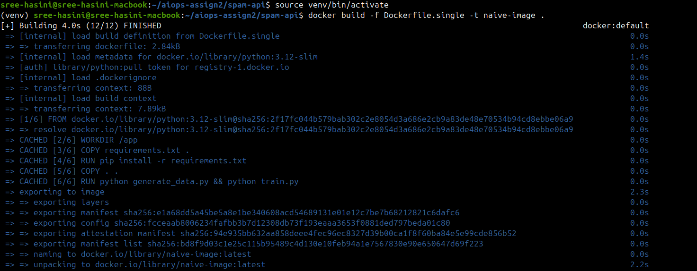

`docker build -f Dockerfile.single -t naive-image .` completing successfully.

**1.2 — Multi-stage image build**
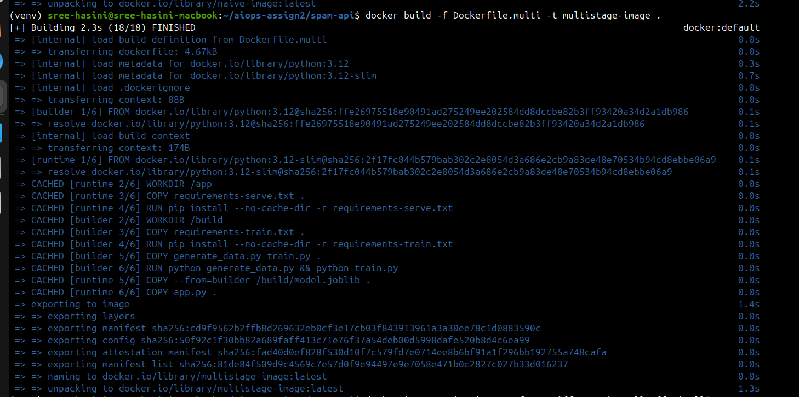
`docker build -f Dockerfile.multi -t multistage-image .` completing successfully.

**1.3 — Size comparison**
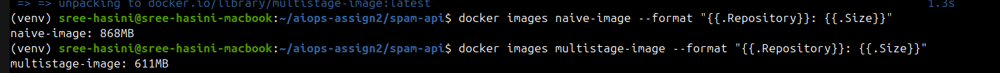
`docker images naive-image multistage-image --format "{{.Repository}}: {{.Size}}"` — the core evidence for the size claim in the write-up.

**1.4 — Naive image serving correctly**
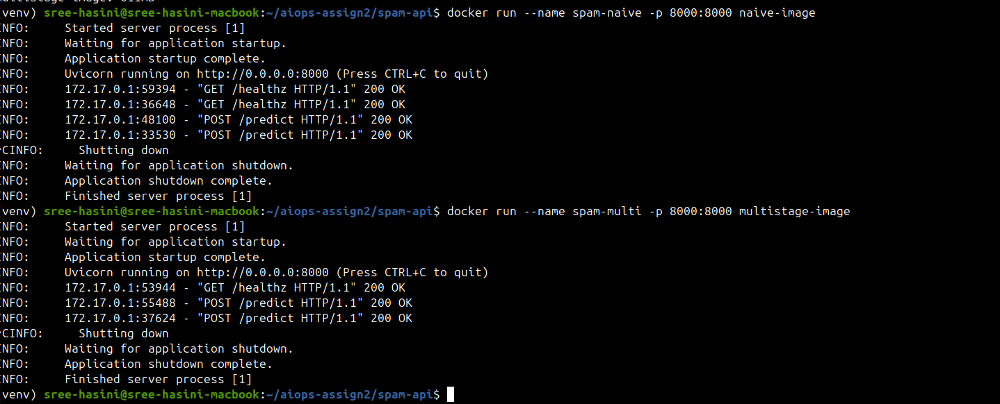
`docker run` the naive image, then `curl .../healthz` and `curl -X POST .../predict` both returning correct responses.

**1.5 — Multi-stage image serving correctly**
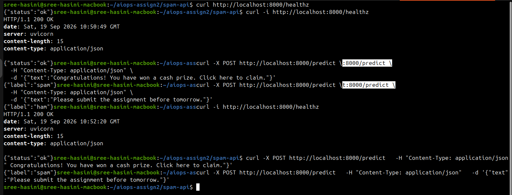
Same two `curl` calls against the multi-stage image, showing identical behavior to 1.4.

---

## Question 2 — Docker Compose + Redis Caching

**2.1 — Stack starting up**
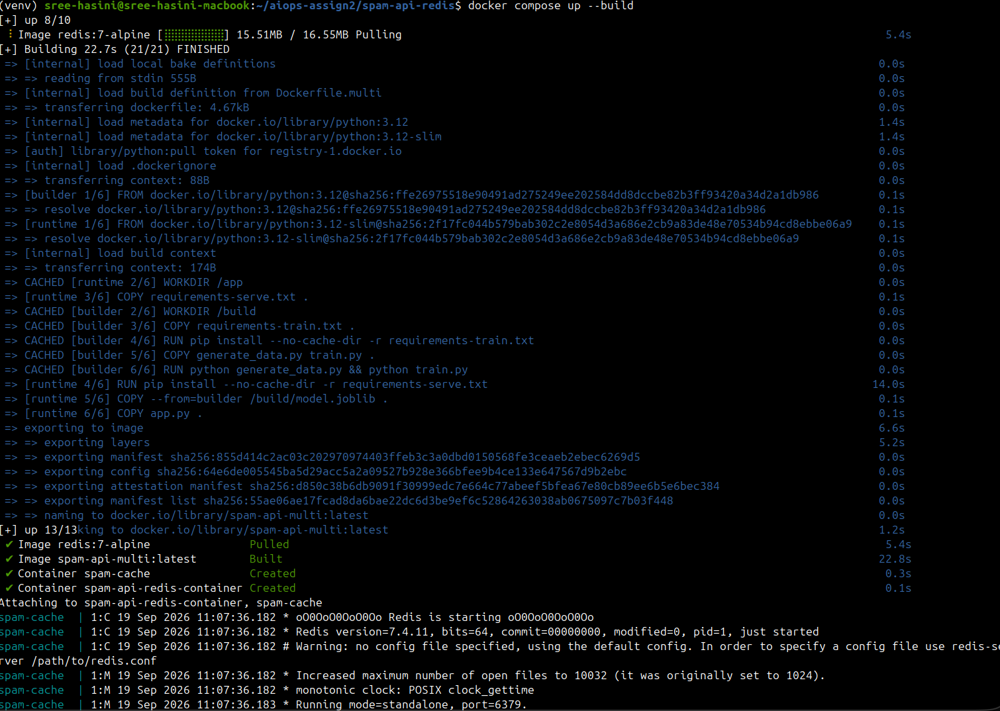
`docker compose up --build -d` completing, both `api` and `cache` containers created.

**2.2 — Both services running**
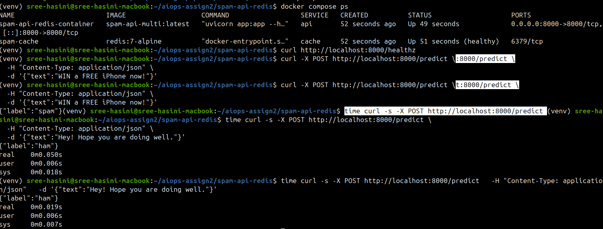
`docker compose ps` (or `docker ps`) showing `spam-api` and `spam-cache` both `Up`.

**2.3 — Cache miss then cache hit, with timing**

**2.4 — Server-side confirmation**

`docker compose logs api` showing the `[cache MISS]` line followed by a `[cache HIT]` line for the same hashed key.

---

## Question 3 — Kubernetes Indexed Job

**3.1 — Image built and loaded onto every node**
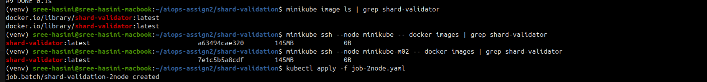
`minikube image build --all -t shard-validator:latest ...` output, plus `minikube ssh --node <name> -- docker images | grep shard-validator` confirming it landed on each node.

**3.2 — 2-node run: pods and parallelism**
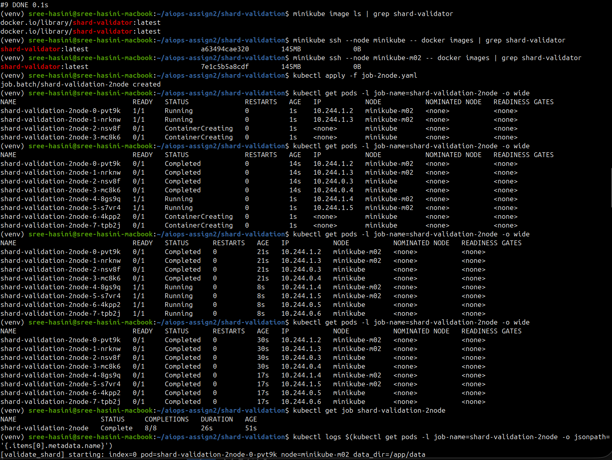
`kubectl get pods -l job-name=shard-validation-2node -o wide` — the `NODE` column should show pods on both nodes, and matching `AGE` values across multiple pods as evidence that `parallelism: 4` produced genuinely concurrent pods, not a sequential queue.

**3.3 — 2-node run: Job completion**
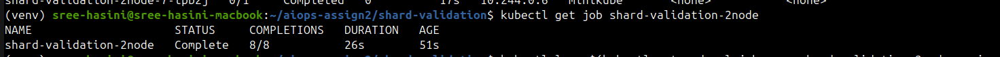
`kubectl get job shard-validation-2node` showing `COMPLETIONS: 8/8`.

**3.4 — 2-node run: collected results**
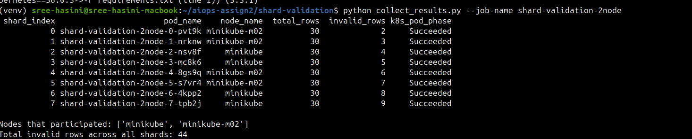
`python collect_results.py --job-name shard-validation-2node` output — all 8 shards, `invalid_rows` matching the planted counts (2–9), `Nodes that participated` showing both nodes.

**3.5 — 3-node run: pods spread across all 3 nodes**
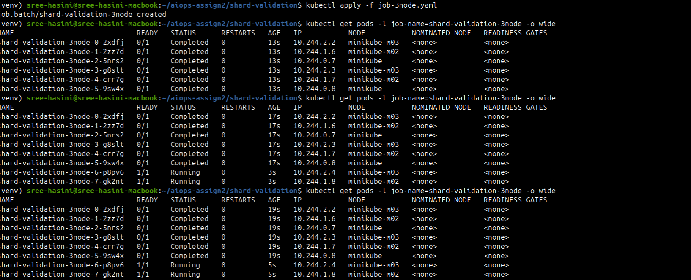
`kubectl get pods -l job-name=shard-validation-3node -o wide` — the `NODE` column should show all 3 distinct nodes in use, evidence for the `parallelism: 6` / `topologySpreadConstraints` change made for the 6-CPU scenario.

**3.6 — 3-node run: Job completion**
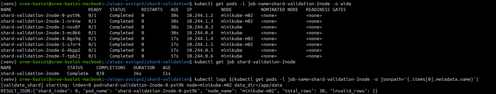
`kubectl get job shard-validation-3node` showing `COMPLETIONS: 8/8`.

**3.7 — 3-node run: collected results**
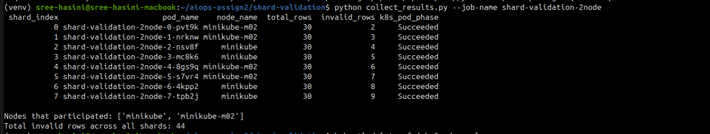
`python collect_results.py --job-name shard-validation-3node --out results_3node.csv` output — `Nodes that participated` showing all 3 nodes; corresponds to `results_3node.csv` in the repo.

---

## Question 4 — Kubernetes Deployment + Service

**4.1 — Deployment and Service applied**
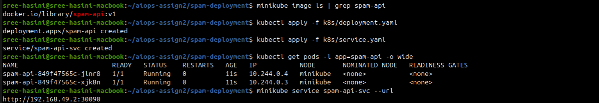
`kubectl apply -f k8s/deployment.yaml` and `kubectl apply -f k8s/service.yaml`, then `kubectl get pods -l app=spam-api -o wide` showing 2 `Running` pods, and `kubectl get svc spam-api-svc`.

**4.2 — Service reachable, v1**
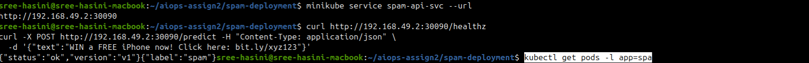
`curl .../healthz` returning `{"status":"ok","version":"v1"}` and `curl -X POST .../predict` returning a correct prediction.

**4.3 — Self-healing: before deletion**
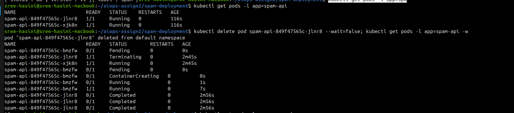
`kubectl get pods -l app=spam-api` showing the 2 original pod names and their `AGE`.

**4.4 — Self-healing: pod deleted, replacement created**
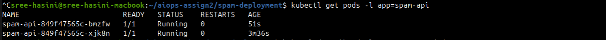
`kubectl delete pod <name>` followed immediately by `kubectl get pods -l app=spam-api` (showing a `Terminating`/new pod), then again a few seconds later showing 2 `Running` pods, one with a new name and near-zero `AGE`.

**4.5 — Self-healing: controller evidence**
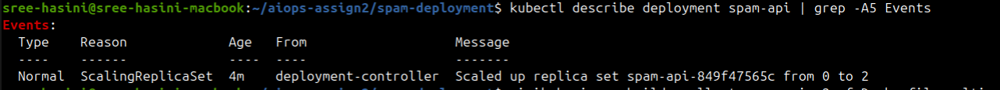
`kubectl describe deployment spam-api` — the `Events` section showing the ReplicaSet scaling back up.

**4.6 — Rolling update: new image built**
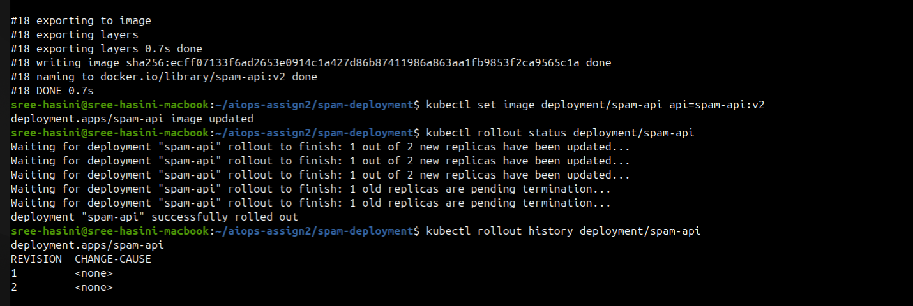
`minikube image build --all -t spam-api:v2 ...` completing successfully.

**4.7 — Rolling update: rollout triggered and completed**

`kubectl set image deployment/spam-api api=spam-api:v2`, then `kubectl rollout status deployment/spam-api` reaching `successfully rolled out`.

**4.8 — Rolling update: history**
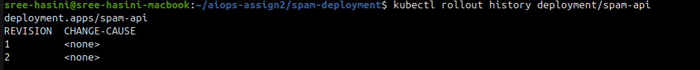
`kubectl rollout history deployment/spam-api` showing at least two revisions.

**4.9 — Rolling update: version visibly changed**
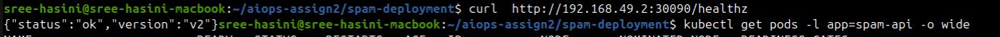
`curl .../healthz` now returning `{"status":"ok","version":"v2"}`.

**4.10 — Rolling update: no downtime**
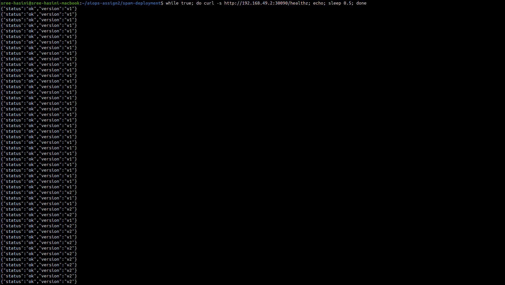
Output of a loop (`while true; do curl -s .../healthz; echo; sleep 0.5; done`) run during the rollout, showing responses flip from `v1` to `v2` with no failed or empty lines in between.